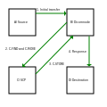

# Configuring the pipeline

This document is an extension of the "Create a pipeline". It explains the many
build in configurations that the library offers.

## Permanent file storage

By default all the dataset is kept in memory. That means if the program is
stopped, all data is lost.
To make the pipeline save a copy to disk you need to overwrite an attribute:

```python
class MyPipeline(AbstractPipeline):
  ...
  data_directory: Union[str, Path] = Path('path/to/data/directory')
  ...
```

The pipeline will now save a copy of each dataset, and delete them when
it's done with the dataset. The file structure produced looks like this:

```text
  data_directory / {\$patient_identifier_tag} / {\$input_arg_name_1} / Image_{\$image.modality}_{\$image.instance_number}.dcm
                                                                           ... / Image_{\$image.modality}_{\$image.instance_number}.dcm
                                               / {\$input_arg_name_2} / Image_{\$image.modality}_{\$instance_number}.dcm
                                                                           ... / Image_{\$image.modality}_{\$image.instance_number}.dcm
                                           ... / ...
                 / {\$patient_identifier_tag} / {\$input_arg_name_1} / Image_{\$image.modality}_{\$image.instance_number}.dcm
                                                                           ... / Image_{\$image.modality}_{\$image.instance_number}.dcm
                                               / {\$input_arg_name_2} / Image_{\$image.modality}_{\$image.instance_number}.dcm
                                                                           ... / Image_{\$image.modality}_{\$image.instance_number}.dcm
                                           ... / ...
             ... / ...
```

The `patient_identifier_tag` is another `AbstractPipeline` attribute, which the
pipeline uses to separate images belonging to differing "batches".
The tag prevents that, if you send a PET from a patient and a CT from another
then both series are accepted, but processing doesn't start on these series.
The value of this tag is shared(equal) among all images used to generate the
`InputContainer` of the processing function.

The tag defaults to the tag PatientID. The `input_arg_name` is a key in the
`input` directory, and each file is an image stored in the input instance.

## Logging

A pipeline creates a logger by default using python standard library, you can modify the following properties to make the logger behave like you want:

```python
class MyPipeline(AbstractPipeline):
  number_of_backups: int = 8
  "Number of backups before the os starts deleting old logs"

  log_date_format = "%Y/%m/%d %H:%M:%S"
  "String format for timestamps in logs."

  log_output: Optional[Union[TextIO, Path, str]] = stdout
  """Destination of log output:
  * `None` - Disables The logger
  * `TextIO` - output to that stream, This is stdout / stderr
  * `Path | str` - creates a rotating log at the path
  """

  log_when = "w0"
  "At what points in time the log should roll over, defaults to monday midnight"

  log_level: int = logging.INFO
  "Level of Logger"

  log_format: str = "%(asctime)s %(name)s %(levelname)s %(message)s"
  "Format of log messages using the '%' style."

  pynetdicom_logger_level: int = logging.CRITICAL + 1
  """Sets the level pynetdicom logger, note that traceback from
  associations are logged to pynetdicom, which can be helpful for bugfixing"""

  ...
```

The logger is injected into most sub-libraries.

## Customizing outputs

Sometimes you want to create a report supplementing an image series or you want to send data over some other form communication protocol. In that case you need to start customizing the output


## Historic Inputs

Sometimes you want historic images to compare against the current image.
Dicomnode has a build-in for just that:
`dicomnode.server.input.HistoricAbstractInput`. However sadly this is not plug
and play solution as many things can go wrong. Hence this is why it has it own
section. So please read this section carefully.

In this section I'll refer the **pivot** series to be the dicom series that the
HistoricAbstractInput uses data from to generate and send it's C-FIND and C-MOVE
DIMSE messages. The retrieved data will be referred to as **historic** series.

### Goal

So inside of your pipeline you would create the following input:

```python
from datetime import date
from typing import Dict
from pydicom import Dataset

  ... # Rest of the Dicomnode node configuration:
  input = {
    "SERIES_TYPE_1" : SERIES_1_INPUT, # Abstract Input Subtype
    "SERIES_TYPE_2" : SERIES_2_INPUT # Abstract Input Subtype
    "HISTORIC"      : HISTORIC_INPUT # Historic Abstract Input Sub type
  }

  def process(input_container):
    historic: Dict[date, Dict[str, Dataset]] = input_container["HISTORIC"]

    # Where the date is the study date and the string is the series description.
```

### Assumptions and restrictions

This components requires a lot of moving parts to work together, which in turn
impose restrictions:

* All datasets have the 0x0008_0020 `StudyDate` Attribute and all historic
  Series have the `SeriesDescription` Attribute
* All non historic input datasets have the same `StudyDate`
* Patients do not have two historic studies on the same day
* You have configured another SCP to accept C-FIND, C-MOVE from the node. In
  normal lingo: The Dicomnode you create must be able to retrieve dicom datasets
* You can retrieve all the data you need over a single association, and a single
  C-FIND, but multiple C-MOVE's
* The Pipeline is configured such that the `PipelineTree` batch historic and
  current studies. (You didn't change `patient_identifier_tag` node attribute
  to StudyInstanceUID as example)

If these Assumption or restrictions are backbreaking - Send patches with the
wine.

### A birds eye view of `HistoricAbstractInput`

A historic input has three different states. Empty, Fetching, Filled

* **Empty** - The Input is initialized, but doesn't know which patient to query
  for.
* **Fetching** - The Input have an active association with a SCP
* **Filled** - The Input have closed it association with the SCP.

Lets get an overview of the entire process with a historic Input:



An external source sends data to our service, and a `PatientContainer` is
created for our patient with an **Empty** `HistoricInput` and some other inputs

The Historic gets a dataset and, sets it status to **Fetching** spawns a thread,
that generates a query Dataset and sends a C-FIND to the SCP. We get some
answers and we pick the studies that we need, and send a C-MOVE for the studies
we need. The connection closes and we set the Input as filled.

### What is going to go wrong:

In the bird eye view we assumed that nothing went wrong and we'll explore what
can go wrong.

#### Historic data masquerading as current data

If we get historic scans, they will pass the filters that is in place for the
other inputs. So they'll be filled into our non historic inputs, which is
problem because they'll overwrite / extend the inputs contents.

To fix this problem you should add `enforce_single_study_date = True` like:

```python

class InputSeries1(AbstractInput)
  ... # All normal stuff

  enforce_single_study_date = True

class InputSeries2(AbstractInput)
  ... # All normal stuff

  enforce_single_study_date = True

class HistoricInput(HistoricAbstractInput)
  ...

```
This will cause the inputs to reject Datasets with an older study date than the
first accepted dataset. Note that it's the first globally accepted dataset, that
determines the pivot study date.
As a likely error is that creating association only supplies datasets for 1
input, then the historic association gets datasets for both inputs, that would
be accepted unless a `enforce_single_study_date` is enabled.

Likewise Historic Input rejects studies with the same study date, as the pivot
study date.
