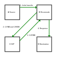

# Configuring the pipeline

This document is an extension of the "Create a pipeline". It explains the many
build in configurations that the library offers.

## Permanent file storage

By default all the dataset is kept in memory. That means if the program is
stopped, all data is lost.
To make the pipeline save a copy to disk you need to overwrite an attribute:

```python
class MyPipeline(AbstractPipeline):
  ...
  data_directory: Union[str, Path] = Path('path/to/data/directory')
  ...
```

The pipeline will now save a copy of each dataset, and delete them when
it's done with the dataset. The file structure produced looks like this:

```text
  data_directory / {\$patient_identifier_tag} / {\$input_arg_name_1} / Image_{\$image.SeriesDescription}_{\$image.instance_number}.dcm
                                                                           ... / Image_{\$image.SeriesDescription}_{\$image.instance_number}.dcm
                                               / {\$input_arg_name_2} / Image_{\$image.SeriesDescription}_{\$instance_number}.dcm
                                                                           ... / Image_{\$image.SeriesDescription}_{\$image.instance_number}.dcm
                                           ... / ...
                 / {\$patient_identifier_tag} / {\$input_arg_name_1} / Image_{\$image.SeriesDescription}_{\$image.instance_number}.dcm
                                                                           ... / Image_{\$image.SeriesDescription}_{\$image.instance_number}.dcm
                                               / {\$input_arg_name_2} / Image_{\$image.SeriesDescription}_{\$image.instance_number}.dcm
                                                                           ... / Image_{\$image.SeriesDescription}_{\$image.instance_number}.dcm
                                           ... / ...
             ... / ...
```

The `patient_identifier_tag` is another `AbstractPipeline` attribute, which the
pipeline uses to separate images belonging to differing "batches".
The tag prevents that, if you send a PET from a patient and a CT from another
then both series are accepted, but processing doesn't start on these series.
The value of this tag is shared(equal) among all images used to generate the
`InputContainer` of the processing function.

The tag defaults to the tag PatientID. The `input_arg_name` is a key in the
`input` directory, and each file is an image stored in the input instance.

## Logging

A pipeline creates a logger by default using python standard library, you can modify the following properties to make the logger behave like you want:

```python
class MyPipeline(AbstractPipeline):
  number_of_backups: int = 8
  "Number of backups before the os starts deleting old logs"

  log_date_format = "%Y/%m/%d %H:%M:%S"
  "String format for timestamps in logs."

  log_output: Optional[Union[TextIO, Path, str]] = stdout
  """Destination of log output:
  * `None` - Disables The logger
  * `TextIO` - output to that stream, This is stdout / stderr
  * `Path | str` - creates a rotating log at the path
  """

  log_when = "w0"
  "At what points in time the log should roll over, defaults to monday midnight"

  log_level: int = logging.INFO
  "Level of Logger"

  log_format: str = "%(asctime)s %(name)s %(levelname)s %(message)s"
  "Format of log messages using the '%' style."

  pynetdicom_logger_level: int = logging.CRITICAL + 1
  """Sets the level pynetdicom logger, note that traceback from
  associations are logged to pynetdicom, which can be helpful for bugfixing"""

  ...
```

The logger is injected into most sub-libraries.

## Customizing outputs

Sometimes you want to create a report supplementing an image series or you want to send data over some other form communication protocol. In that case you need to start customizing the output


## Historic Inputs

Sometimes you want historic images to compare against the current image.
Dicomnode has a build-in input for just that:
`dicomnode.server.input.HistoricAbstractInput`. However sadly this is not plug
and play solution as many things can go wrong. Hence this is why it has it own
section. So please read this section carefully.

In this section I'll refer the **pivot** series to be the dicom series that the
HistoricAbstractInput uses data from to generate and send it's C-FIND and C-MOVE
DIMSE messages. The retrieved data will be referred to as **historic** series.

In general it's assumed that the studies we retrieve will go into the historic
input and not in the normal abstract inputs, while the historic input will only
contain historic datasets.

For those with limited dicom terminology a `SCP` is just a program, that you can
send C-FIND's and C-MOVE's to and it responds like expected. These are often
specialized databases that work with dicom images.

### Goal

So inside of your pipeline you would create the following input:

```python
from datetime import date
from typing import Dict
from pydicom import Dataset

  ... # Rest of the Dicomnode node configuration:
  input = {
    "SERIES_TYPE_1" : SERIES_1_INPUT, # Abstract Input Subtype
    "SERIES_TYPE_2" : SERIES_2_INPUT, # Abstract Input Subtype
    "HISTORIC"      : HISTORIC_INPUT, # Historic Abstract Input Sub type
  }

  class Processor(AbstractProcessor):
    def process(self, input_container):
      historic: Dict[date, Dict[str, Dataset]] = input_container["HISTORIC"]

    # Where the date is the study date and the string is the series description.
```


### Assumptions and restrictions

This components requires a lot of moving parts to work together, which in turn
impose restrictions:

* All datasets have the 0x0008_0020 `StudyDate` Attribute and all historic
  Series have the `SeriesDescription` Attribute
* All non historic input datasets have the same `StudyDate`
* Patients do not have two historic studies on the same day
* You have configured another SCP to accept C-FIND, C-MOVE from the node. In
  normal lingo: The Dicomnode you create must be able to retrieve dicom datasets
* You can retrieve all the data you need over a single association, and a single
  C-FIND, but multiple C-MOVE's
* The Pipeline is configured such that the `PipelineTree` batch historic and
  current studies. (You didn't change `patient_identifier_tag` node attribute
  to StudyInstanceUID as example)

If these Assumption or restrictions are backbreaking - Send patches with the
whine.

### Modification to non-historic inputs

The "common" use case that the library attempts to handle is: Comparison between
old and new series of the same type. This poses a problem, where your normal
input would accept and add both the historic and current series, which is not
desirable because by default inputs assumes that there's only a single series in
them. You also cannot solve this by adding `enforce_single_series` because if
the historic series is added first, then the current series will be rejected.

To solve this issue you must add `enforce_single_study_date = True` to all non
historic inputs. When any non historic input accepts an image, the study_date
attribute is set for ALL abstract inputs.


### A birds eye view of `HistoricAbstractInput`

A historic input has three different states. Empty, Fetching, Filled

* **Empty** - The Input is initialized, but doesn't know which patient to query
  for.
* **Fetching** - The Input have an active association with a SCP
* **Filled** - The Input have closed it association with the SCP.

Lets get an overview of the entire process with a historic Input:



An external source sends data to our service, and a `PatientContainer` is
created for our patient with an **Empty** `HistoricInput` and some other inputs

The Historic gets a dataset and, sets it status to **Fetching** spawns a thread,
that generates a query Dataset and sends a C-FIND to the SCP. We get some
answers and we pick the studies that we need, and send a C-MOVE for the studies
we need. The connection closes and we set the Input as filled.

### The nitty-gritty implementation details

#### Historic Attributes

A historic input have different requirements to a standard abstract input.
First of all a historic endpoint need an `address` attribute of type:
`dicomnode.dicom.dimse.Address`. This address must accept C-FIND and C-MOVE from
the node using the nodes AE title. The node must also have been created as a
move destination in the SCP.

Unlike normal inputs you should **NOT** overwrite the validate function. A
historic input validates to true when It has finished a single connection to the
`SCP`.

#### C-FIND, C-MOVE - Query and Retrieve

To retrieve a history, you need to use the two DICOM Message Service Element
**(DIMSE)** commands:

* C_FIND - Used to index for the historic studies.
* C_MOVE - Used to transfer the studies from your archive to the dicomnode for
  processing.

When the pivot dicom datasets are send from the source, the `add_image` is
called for all `AbstractInput`s are called as normal, but The historic inputs
`add_image` is a tad different. Instead of trying to add the image to itself,
it calls:
`check_query_dataset(self, current_study: Dataset, query_dataset: Optional[Dataset] = None) -> Optional[HistoricAction, Dataset]`
Where the `current_study` argument is the dataset send by the source.

This function purpose is to determine if the "current_study" should send a dimse
message or not. It should return one of three things:

* None - The current study should not send any DIMSE message
* Tuple[HistoricAction.FIND_QUERY, Dataset] - Dicomnode should send a C-FIND
  with the dataset as the querying dataset
* Tuple[HistoricAction.MOVE_QUERY, Dataset] - Dicomnode should send a C-MOVE
  with the dataset as the querying dataset

`check_query_dataset` is called once from pivot series with `query_dataset=None`
and for each C-FIND response with the `query_dataset` equal to the dataset used
for the query. You can (and should) chain C-FINDs together such that you only
request the series you need.
This is because most DICOM studies contain a lot of auxiliary data, that in best
case just takes extra time.
