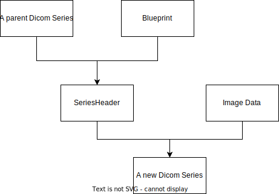

# Building a dicom Series

## Introduction

Dicom node is a dicom in and dicom out, however in most pipeline you will
transform the dicom input into some other data format, for processing.
You will need to transform data back into dicom, which this tutorial is about.

## Building a series

### The Blueprint.

Try and image you should build a house however, there is still many unknowns:
The soil, the material, the interior and so fourth. You would start with
drawing a blueprint, and as more information become available you would make
the blueprint more and more concrete until you had a house.

This library is in the business of making dicom series, and there's many
unknowns, but we start by making a blueprint of series, which is found in:
 `dicomnode.dicom.dicom_factory`

```Python
from dicomnode.dicom.dicom_factory import Blueprint

blueprint = Blueprint()
```

At this point the blueprint is empty or the equivalent to a white paper house
blueprint. We need to fill it with virtual elements which are equivalent to
lines in a normal blueprint.

A virtual element describes to construct a single tag in a dicom series. For
instance, the series description should probably indicate that this image was
produces by your pipeline and the tag should be set in all images of the dicom
series. This is done with a `StaticElement`, because we know what should be in
the tag before our pipeline is even running.

```Python
# Code continued from earlier example
from dicomnode.lib.dicom_factory import StaticElement

blueprint.add_virtual_element(
  StaticElement(0x0008103E, 'LO', 'My pipeline Series Description')
)
```
The arguments are:

* The tag - that should be filled in the dicom series
* The VR - of the tag
* The Value - That should be filled in the tag.

#### A Virtual Tag Round tour

The rest of this section will is dedicated to the various types of
`VirtualElements`. These are the building blocks of a blueprint and should be
used to fill out your blueprint. Note that you should be look out for similar
patterns to determine which virtual element you should use.

##### Series Element

With the series description we were lucky because we knew the value beforehand,
but for some tags we don't. for instance Series Instance UID. For this we need
a function to produce the value, which then will be shared among all the images
of the series.

```Python

from dicomnode.lib.dicom_factory import SeriesElement
from dicomnode.lib.dicom import gen_uid # Generates a UID

blueprint.add_virtual_element(
  SeriesElement(0x00200000E, 'UI' gen_uid)
)
```

##### Copy Element

In the case where you are not fabricating data, you have some input data, which
is one or more dicom series. You often want to pull values from the that
series. In that case you would use a `CopyElement`


```Python

from dicomnode.lib.dicom_factory import CopyElement

blueprint.add_virtual_element(
  CopyElement(0x00200010) # Study UID
)
```

However sometimes your dicom input pictures many not have this tag available
and you need to decide if you should continue or abort. By default you'll abort
but you can add the `optional` key word if you wish to continue.


```Python

from dicomnode.lib.dicom_factory import CopyElement

blueprint.add_virtual_element(
  CopyElement(0x00081030, optional=True) # Study UID
)
```

##### Discard Element

Discard elements are element indicating that the element should be discarded.
To understand why this tag is relevant. Think about all the tags in the input
dicom series. If a tag isn't present in the Blueprint, how should you proceed?

By default there's two option either copy or discard the missing element. In
the case you default to copy, but there some tags you know shouldn't be copied.
You need a discard element to express that wish.

##### FunctionalElement

So far all virtual element produces a value that is shared among the series.
To get a different value per slice you need to use a functional element.

This function are given a `InstanceEnvironment` as argument which is a
data class in `dicomnode.lib.dicom_factory`:

```python
from dicomnode.lib.dicom_factory import FunctionalElement

@dataclass
class InstanceEnvironment:
  instance_number: int
  kwargs : Dict[Any, Any] = {}
  header_dataset: Optional[Dataset] = None
  image: Optional[Any] = None # Unmodified image
  factory: Optional['DicomFactory'] = None
  intercept: Optional[float] = None
  slope: Optional[float] = None
  scaled_image: Optional[Any] = None
  total_images: Optional[int] = None

def my_function(instance_environment: InstanceEnvironment) -> ...
  return ...

blueprint.add_virtual_element(FunctionalElement(tag, VR, my_function))
```


##### InstanceCopyElement

Not all dicom tags are the same along the series, and in the case that you need
to copy the value of a varying tag. You need to use an InstanceCopyElement.
**A requirement to using InstanceCopyElement is that the original series has**
**the InstanceNumber(0020,0013) tag filled!**
Otherwise the element is similar to a CopyElement

##### SequenceElement

Adding a Sequence to the produced image can be tricky. In the case where you
know how many Sequence elements that should be created you can use a
`SequenceElement`, by injecting the tag with a list of blueprint. Each
blueprint corresponds to member of the Sequence.

```python
from dicomnode.lib.dicom_factory import SequenceElement

blueprint = Blueprint()
sequence_blueprint()

```

Dynamic length sequences are a tag more tricky but can created using
`FunctionalElement`'s:

```python
from pydicom import Sequence
from random import randint

def my_sequence_generator(instance_environment: InstanceEnvironment):
  sequence = [Dataset() for _ in range(randint(1,10))]

  return Sequence(sequence)

blueprint.add_virtual_element(FunctionElement(tag,
                                              'SQ',
                                              my_sequence_generator))
```

You can parse user defined data in by the kwargs value when you build the series.

### Factories & Default blueprints

So a blueprint is just the idea of a series and you need something to produce
the series whenever the pipeline is running, this is the purpose of a
`DicomFactory`. This is a base class which should be specialized to the input
data. So for instance the `NumpyFactory` is dicom factory witch creates dicom
series from a numpy array.

These Factories have a default blueprint, which you should be included your
blueprint. Either by starting out from the blueprint or combining the
blueprints:

```python

# Note this code doesn't work because DicomFactory is an abstract class
dicom_factory = DicomFactory()
# Method 1
blueprint_1 = dicom_factory.get_default_blueprint()
... # fill with tags

# Method 2
blueprint_2 = Blueprint()
... # fill with tags

blueprint_2 += dicom_factory.get_default_blueprint()
```

## Building a dicom series in a pipeline

At run time you'll get an intermediate data structure called a `SeriesHeader`.
Which contains all of the shared information of the input dicom series. This is
what you'll use to construct the out dicom series.

With the data flow seen can be seen below:



To implement a dicom factory and blueprint in a pipeline you need to overwrite
some tags in the `AbstractPipeline` similar to how is done in:
[create a pipeline](./create_a_pipeline.md).


You need to fill the attributes:

* `dicom_factory: Optional[DicomFactory]` - This is the factory, that is used
to create the series header. Note that this object is shared with all threads.
* `header_blueprint: Optional[Blueprint]` - Blueprint to construct series
header from.

Futhermore there's two Optional Attributes.

* `parent_input: Optional[Str]` - Specifies the input series to be used as
parent, must equal a key in the `input` attribute. If unspecified a random
input series is used.

If you have filled these attributes in the node, then in the process function
the `InputContainer` will have an `header` attribute with a `SeriesHeader` that
you can pass to your `DicomFactory` along with image data to produce a new
dicom series.

## Example

```python
from dicomnode.dicom.dicom_factory import Blueprint, DicomFactory, SeriesHeader ...
from dicomnode.server.nodes import AbstractPipeline

class MyFactory(DicomFactory):
  def build_from_header(series_header: SeriesHeader, image: Any) -> List[Dataset]
    ...

  def get_default_blueprint(self):
    return Blueprint([
      ...
    ])

factory = MyFactory()

blueprint = Blueprint([
  ...
]) + factory.get_default_blueprint()


class MyPipeline(AbstractPipeline):
  ...
  dicom_factory = factory
  header_blueprint = blueprint

  def process(self, input_container)
    image = ...

    datasets = self.dicom_factory.build_from_header(input_container.header, image)
```

Note that it's unlikely that you need to impliement your own DicomFactory, as there's a few build into the library:

* NumpyFactory - numpy arrays
* NiftiFactory - nifti images
