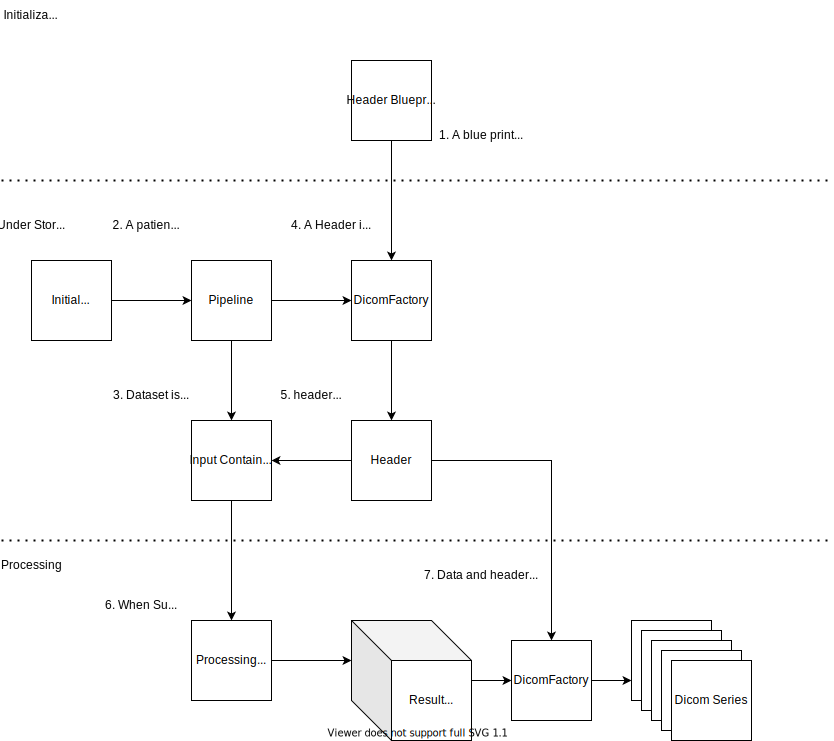

### Configuring the pipeline

So far we have only scratched the surface of configuration. To get the full overview, I suggest reading the `nodes.py` file, but some common configuration can be found below:

#### Permanent file storage

By default all the dataset is kept in memory. That means if the program is stopped, all data is lost.
To make the pipeline save a copy to disk you need to overwrite an attribute:

```python
class MyPipeline(AbstractPipeline):
  ...
  root_data_directory: Union[str, Path] = Path('path/to/data/directory')
  ...
```

The pipeline will now save a copy of each dataset, and delete them when it's done with the dataset.
The file structure produced looks like this:

```text
  root_data_directory / {\$patient_identifier_tag} / {\$input_arg_name_1} / Image_{\$image.modality}_{\$image.instance_number}.dcm
                                                                                ... / Image_{\$image.modality}_{\$image.instance_number}.dcm
                                                   / {\$input_arg_name_2} / Image_{\$image.modality}_{\$instance_number}.dcm
                                                                                ... / Image_{\$image.modality}_{\$image.instance_number}.dcm
                                               ... / ...
                      / {\$patient_identifier_tag} / {\$input_arg_name_1} / Image_{\$image.modality}_{\$image.instance_number}.dcm
                                                                                ... / Image_{\$image.modality}_{\$image.instance_number}.dcm
                                                   / {\$input_arg_name_2} / Image_{\$image.modality}_{\$image.instance_number}.dcm
                                                                                ... / Image_{\$image.modality}_{\$image.instance_number}.dcm
                                               ... / ...
                  ... / ...
```

The `patient_identifier_tag` is another pipeline attribute, which the pipeline uses to separate images belonging to differing batches.
The tag defaults to the tag PatientID. The `input_arg_name` is a key in the input directory, the files are the images stored in the input instance.

#### Logging

If you have tried and run your pipeline in a terminal, you'll without a doubt noticed some messages. These are logging messages, and by default they are passed to print on the screen, and doesn't really create a permanent record. To get a "permanent log" you need to set a path, where the log can be stored:

```python
class MyPipeline(AbstractPipeline):
  ...
  root_data_directory: Union[str, Path] = Path('path/to/log')
  ...
```

The pipeline will now create a rotating timed log, that means every week at monday midnight it's going to move the file into a backup file. The pipeline keeps up to 8 backup logs, or 2 months worth of logs. This is done to prevent, that the logs grow massively and fill the server the pipeline is running on.

#### Header & Dataflow

The dicomnode lib is intended to provide all the basic functionality of a dicom pipeline. Therefore if a feature would be present in most pipelines, then it's the goal of the library to provide a standard solution. In most data processing pipelines they do not use dicom as the data format, instead they use the format native to the various processing library. I.E `Tensor` for pytorch or tensorflow, `numpy.Array` for numpy, or nifty format for a thrid party program.

Transforming the dicom files into an appropriate data format is the job of the various grinder functions, however once the processing is done, the data still remains in the data format optimized for processing and a conversion back to dicom is required. This is the job of the `DicomFactory` and the `HeaderBlue`.

Before continuing it's helpful to have an overview of the dataflow through the pipeline. It can be seen below:



Lets start by defining what the difference between a HeaderBlueprint and a Header.

A `HeaderBlueprint` consists of a number over `VirtualElements` and is shared among ALL datasets produced by the pipeline. While a `Header` is an "instance" of said blueprint, and is shared among Dicom images of that produced series. It consists of `DataElement`s and `CallElement`s.

A `DataElement` is a class from the pydicom package and represents a Tag, a VR and a Value in a dicom image. While a `VirtualElement` is Class which produces a `DataElement` by some class specific method. This process is called corporealialization. Most `VirtualElement`s are created when the first dataset is provided as they should be shared by all images, such as patient name or study date and so forth. However a subset of tags cannot be created before the image is available such as the image, these `VirtualElement`s are called `CallElement`s.

`CallElement`s corporealialize only then they have the image available to them.

To help programmers create dicom pictures which are dicom standard compliant, various sets of blueprints for HeaderBlueprint are included in the library and the programmer should choose one based on the SOPClassUID of the produced in the post processing.

Assuming the programmer is using numpy for data processing a code snippet can be seen below how it's intended to be used.

```python
from dicomnode.lib.dicomFactory import StaticElement, HeaderBlueprint
from dicomnode.lib.numpyFactory import NumpyFactory, get_blueprint

Produced_SOP_class_UID = ...


my_blueprint = HeaderBlueprint([
  StaticElement(...),
  ...
])

blueprint = get_blueprint(Produced_SOP_class_UID) + my_blueprint

class MyPipeline(AbstractPipeline):
  header_blueprint = blueprint
  dicom_factory = NumpyFactory()


  def process(self, input_container: InputContainer) -> PipelineOutput:
    ...

    data_series = self.dicom_factory.make_series(input_container.header, numpy_array)

    output = PipelineOutput([(address, data_series)])

    return output
```

The addition between two blue print are not a commutative operator, ie: `blueprint_1 + blueprint_2 != blueprint_2 + blueprint_1` because of how tag collision is handled. The Tags of the second blueprint is dominant. Each addition does produce a new object.

#### Customizing outputs

Sometimes you want to create a report supplementing an image series or you want to send data over some other form communication protocol. In that case you need to start customizing the output
